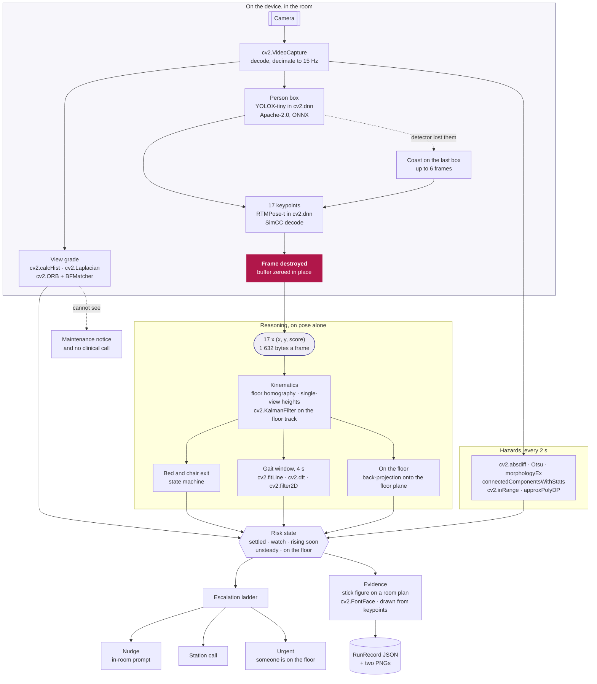
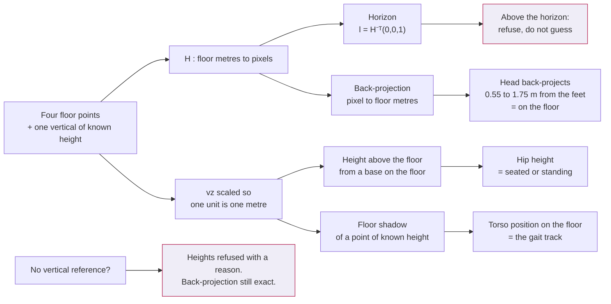
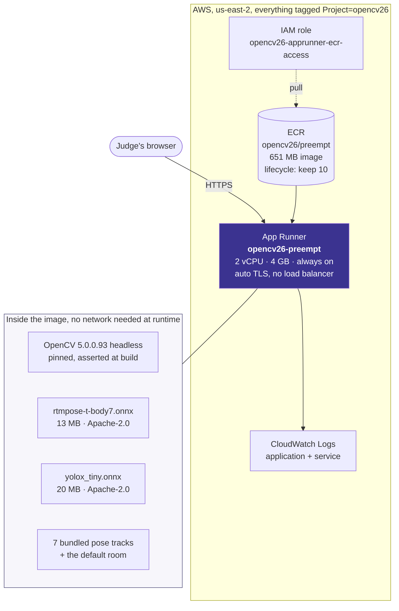
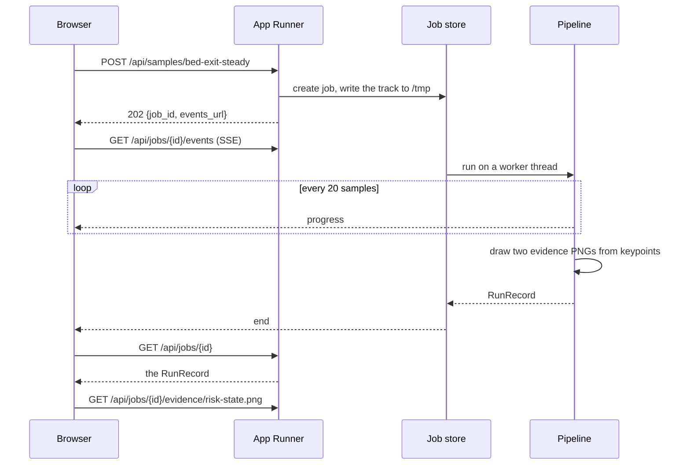

# Architecture

Two diagrams: what happens to a frame, and what runs on AWS.

## 1. The pipeline

The important thing in this diagram is the red box. Every stage to its right
works on seventeen (x, y, score) triples, and no stage to its right can be handed
an image, because none of their signatures accept one.

### Why each OpenCV 5 call is where it is

| Stage | OpenCV 5 | Why this and not something else |
|---|---|---|
| Decode | `VideoCapture` | OpenCV 5 returns **-1** for an unsupported property where 4.x returned 0; `visioncore.imageio` treats anything below zero as missing. |
| Detect | `dnn.readNetFromONNX(engine=ENGINE_NEW)` | `readNetFromCaffe` and `readNetFromDarknet` are **gone** in OpenCV 5. Everything is ONNX now. The new graph engine is 1.6x faster on YOLOX than the classic one at the same call site. |
| Pose | the same net, SimCC head | Two outputs, so `net.forward(names)` rather than `net.forward()`. |
| Floor | `findHomography`, `perspectiveTransform` | Not `solvePnP` with `SOLVEPNP_IPPE_SQUARE`, which returns an ambiguous solution: the foundation agent measured it reporting 2 degrees for a true 20 degree tilt. |
| Zones | `pointPolygonTest` | Signed distance, so "0.4 m outside the bed" is one call. |
| Track | `KalmanFilter` | Keypoints are noisy at the centimetre level and a raw difference of two noisy positions at 15 Hz is almost pure noise. A filter also predicts through a dropout where a difference spikes. |
| Gait | `fitLine`, `getGaussianKernel` + `filter2D`, `dft` | The walking line is fitted, so walking round a corner is not scored as sway. |
| View | `calcHist`, `Laplacian`, `ORB` + `BFMatcher` | Darkness, a blocked lens and a knocked camera are three different failures and get three different names. |
| Hazards | `absdiff`, Otsu `threshold`, `morphologyEx`, `connectedComponentsWithStats`, `inRange`, `approxPolyDP`, `convexHull` | Classical, explainable, and every number traceable to a pixel count and a homography. |
| Evidence | `FontFace` + `putText`, `polylines`, `fillPoly` | OpenCV 5's TrueType text engine, so a ward screenshot does not look like a 1990s machine-vision demo. |

## 2. The geometry, in one picture

A single homography between the image and the floor gives a metric frame. With a
vertical reference rescaled so one unit is one metre, `p ~ H·b + h·vz`, which
gives a height when the floor position is known and a floor position when the
height is known.

A single view cannot place a point of unknown height, and cannot measure the
height of a point whose floor position is unknown. That is a real limitation and
it is not worked around: a point of unknown height is placed by assuming it is
above the person's foot contact, which is true to a few centimetres for a hip and
false for an outstretched hand, and the code says which of the two it is doing.

## 3. AWS

**No load balancer, deliberately.** An idle ALB is about $16 a month for nothing,
and App Runner gives HTTPS and a stable hostname without one.

**No S3 in the request path, deliberately.** Everything a run produces is either a
few kilobytes of JSON or two drawn PNGs, and the privacy argument is easier to
make about a service that writes nothing durable at all. Uploads live in the
container's `/tmp` and expire with the job.

**us-east-2 rather than us-east-1**, because this account is limited to two App
Runner services per region and both us-east-1 slots were already taken by other
work. Preempt is the only one of the five entries outside us-east-1, so a
project-wide diagram would show four services in one region and this one in
another. Recorded in `docs/costs.md`.

## 4. The request, end to end

A judge's own video takes the same path and runs YOLOX and RTMPose over it.
`/version` reports the OpenCV version, the git sha and the model licences, so
what ran is checkable rather than asserted.
